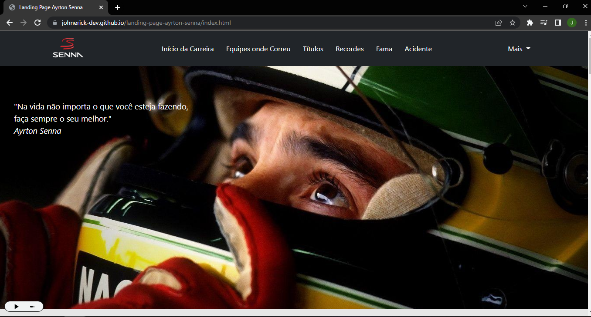
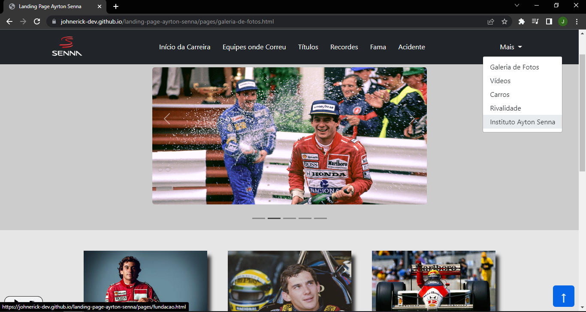

# Landing Page

### Produção independente de landing page do piloto Ayrton Senna. Projeto realizado no intuito de consolidar o aprendizado no desenvolvimento web front end.

## Tecnologias

Esse projeto foi desenvolvido com as seguintes tecnologias:

- HTML
- CSS
- JavaScrip
- Bootstrap

### Confira o resultado final acessando https://johnerick-dev.github.io/landing-page-ayrton-senna/

  

## Demonstração do site

